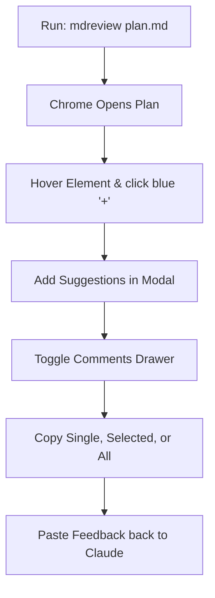

# Markdown Review Tool Summary

I have created a review-enabled Markdown previewer directly in your workspace. You can now use this tool to add inline suggestions to Claude implementation plans (or any markdown file) and export them with full context to pass back to Claude.

Here is a summary of the files created and configured:

1. **Review Script**: [preview-markdown.js](file:///Users/varundua/codebase/chrome/review-tool/preview-markdown.js)
   - Handles resolving paths, parsing markdown, styling, and generating the temporary workspace file.
   - Embeds the commenting system, modal popups, scroll-to crosshairs, and markdown reporting logic.
2. **Mock Test File**: [example-plan.md](file:///Users/varundua/codebase/chrome/review-tool/example-plan.md)
   - A mock Claude implementation plan containing code blocks and tables to test the commenting interface.
3. **Workspace Documentation**: [README.md](file:///Users/varundua/codebase/chrome/review-tool/README.md)
   - Detailed walkthrough of UI features, terminal setups, and workflow guidelines.
4. **Shell Configuration Updated**: [.zsh_markdown](file:///Users/varundua/zsh_profile/.zsh_markdown)
   - Appended a new `mdreview` function to your zsh profile configuration, pointing to your project's new previewer.

---

## 🛠 Terminal Commands

To reload your configuration and start reviewing:

```bash
# 1. Source commands
source ~/zsh_profile/.zsh_commands

# 2. Start a review
mdreview example-plan.md
```

---

## 💡 Review Workflow



- **Interactive Hover**: Hovering over elements shows a blue `+` button in the left margin.
- **Context Pinning**: Comments are pinned using a content hash and tag index, saving them persistently in `localStorage` keyed by your file's absolute path.
- **Scroll Spy & Locate**: The drawer groups comments by section. Clicking **Locate** scrolls directly to the commented element with a pulsing visual highlight.
- **Flexible Copy Options**:
  - **Single Comment**: Click the **Copy** icon directly on a card to copy only that comment.
  - **Set of Comments**: Click comment cards to toggle their selection, then click **Copy Selected (N)** at the top. Toggle all using **Select All** in the bulk actions bar.
  - **All Comments**: Click **Copy All for Claude** at the bottom of the drawer.
- **Claude Export Format**: Copied comments generate a beautifully formatted markdown snippet where code blocks and sections are nested inside blockquotes, making it easy for Claude to identify the exact context of your suggestions.
